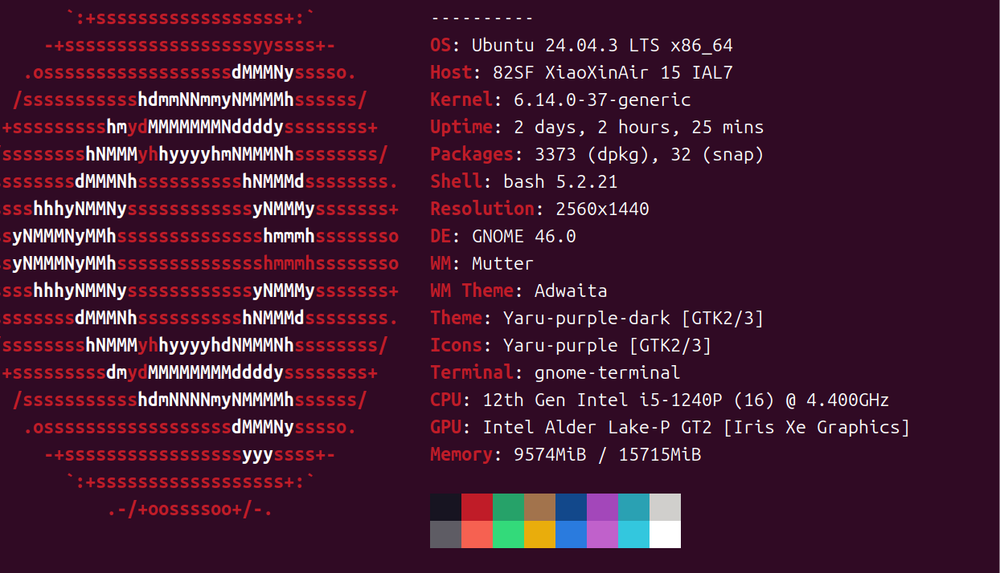
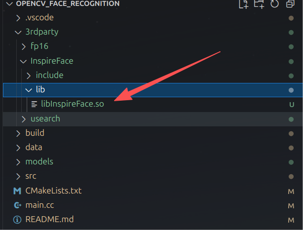

# C++人脸识别

这个项目是基于C++实现人脸识别的功能，使用了三种后端人脸识别算法，分别是dlib、opencv和insightface，而且还使用了sqlite3数据库去作为人脸数据的存储，并且使用了usearch去作为人脸匹配的向量搜索引擎。

## 搭建环境

### opencv环境

安装相关依赖

```bash
# 安装ffmpeg，GStreamer依赖
apt install -y libjpeg-dev libpng-dev libtiff-dev libwebp-dev libopenexr-dev
apt install libavcodec-dev libavformat-dev libavutil-dev libswscale-dev libswresample-dev
apt install libgstreamer1.0-dev libgstreamer-plugins-base1.0-dev
apt install libv4l-dev v4l-utils
```

```bash
# 安装GUI依赖支持
apt install libgtk-3-dev
apt install libgl1-mesa-dev libglu1-mesa-dev
```

opencv人脸识别方案是基于opencv_zoo去实现的，尽量使用opencv4.9.0版本以上，github链接：

> https://github.com/opencv/opencv_zoo

编译源码

```bash
wget https://github.com/opencv/opencv/archive/refs/tags/4.10.0.zip
```

```bash
unzip 4.10.0.zip

#进入OpenCV源码
cd opencv-4.10.0

# 创建build文件夹
mkdir build
cd build
```

```bash
cmake \
    -D CMAKE_BUILD_TYPE=RELEASE \
    -D OPENCV_GENERATE_PKGCONFIG=ON \
    -D WITH_V4L=ON \
    -D WITH_GSTREAMER=ON \
    -DWITH_GTK=ON \
    -D WITH_FFMPEG=ON \
    -D BUILD_OPENJPEG:BOOL=ON \
    -D BUILD_opencv_python=OFF \
    -D BUILD_EXAMPLES=OFF \
    ..
```

```bash
#后面跟的数字表示你启用多少cpu核数去进行编译，我这里用4核
make -j4
```

### dlib环境

拉取源码

```bash
git clone https://github.com/davisking/dlib.git
```

然后切换为v20.0分支

```bash
cd dlib

git checkout v20.0
```

```bash
mkdir build
cd build
cmake ..   -DCMAKE_BUILD_TYPE=Release   -DDLIB_USE_CUDA=OFF   -DUSE_AVX_INSTRUCTIONS=ON
make -j14
sudo make install
```

上面是编译dlib的指令，注意一下cmake，如果你的设备支持CUDA就可以选择开启，如果你的CPU支持AVX就开启

```bash
lscpu | grep avx
```

### InspireFace环境（使用v1.2.3版本）

> 参考：https://github.com/HyperInspire/InspireFace
>
> SDK的release版本：https://github.com/HyperInspire/InspireFace/releases

### sqlite环境

```bash
sudo apt update
sudo apt install sqlite3
```

安装完成后，验证版本：

```bash
sqlite3 --version
```

### Usearch向量搜索引擎

> github链接：https://github.com/unum-cloud/USearch

## 运行案例

这里先说明一下，我是使用如下图所示的设备去编译运行的，当前拉取下来的项目使用的InspireFace库是在我这个设备编译的动态库，这里如果你想使用的话请你记得根据你的设备去修改动态库文件（可自行编译或使用release版本）。





拉取代码

```bash
git clone https://github.com/Fitz8863/face_recognition.git

cd face_recognition
```

编译

```bash
mkdir build
cd build

#这里你可以选择你想使用哪种人脸识别算法去进行编译，-DUSE_DLIB=ON 表示开启编译dlib人脸识别后端，-DUSE_OPENCV=ON 表示开启编译opencv人脸识别后端，-DUSE_INSPIREFACE=ON 表示开启编译InspireFace后端。如果你没有指定的话默认是使用InspireFace方式
# cmake -DUSE_DLIB=ON -DUSE_OPENCV=ON -DUSE_INSPIREFACE=ON ..  #三个都开启
cmake .. #不指定就默认使用InspireFace

make -j4
```

运行

```bash
export LD_LIBRARY_PATH=$LD_LIBRARY_PATH:/your_path/3rdparty/InspireFace/lib

./face inspireface # 这里注意一下，你cmake使用了什么后端，这里才支持什么类型的后端
```


